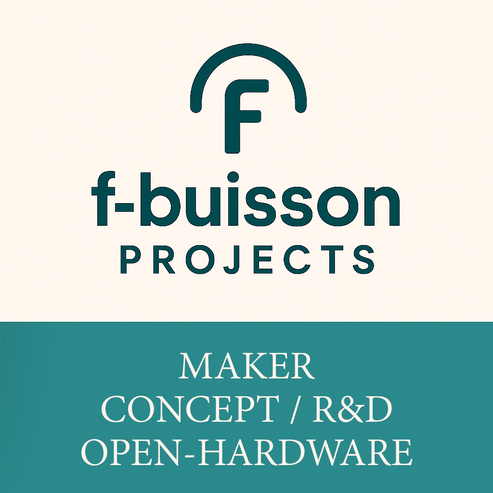

  

  
# Open-hardware designer & low-tech systems maker

> I build practical, low-energy systems for learning, repair and sustainability.

# 👋 Hey, I’m **Fabien Buisson**

🛠️ _Citizen-inventor_ · low-tech & open design · based in France  

---

### Contact

- ✉️ Email : [fbuisson38550@gmail.com](mailto:fbuisson38550@gmail.com)

---

## 🚀 Live projects

| Project | TL;DR | Status | Docs |
|---------|-------|--------|------|
| **💧 SolarWell** | Low-tech solar distillation unit for turning seawater or polluted water into drinkable water using only the sun. | **Concept • open R&D** | [Repo](https://github.com/f-buisson/SolarWell) |
| **🏋️ SolarLift** | Thermal-gravity storage using solar heat (air, water or thermal-fluid expansion → lifting a weight). Early concept, fully documented. | **Concept • open R&D** | [Repo](https://github.com/f-buisson/SolarLift) |
| **🧠 BioSym** | Symbiotic, modular, open framework to connect water + energy + storage + IA (grids). Concept to be developed. | **Concept • fully documented** | **[Repo (BioSym)](https://github.com/f-buisson/BioSym)** · [Vision](docs/Vision.md) |
| **🔆 Solar Flare** | Foldable solar concentrator (Fresnel lens + parabolic mirrors). V1 CAO (SOLIDWORKS) | **CAO V1.3** | [Repo](https://github.com/f-buisson/Solar-Flare) |
| **🎈 Plushie – breathe with me** | Interactive plush that breathes, stops, then revives with chest compressions (calm-breathing & CPR tool). | **Active • makers welcome** | [Repo](https://github.com/f-buisson/plushie-breathe-with-me) · [Tech overview](https://github.com/f-buisson/plushie-breathe-with-me/blob/main/tech/DOUDOU_TECH_OVERVIEW.md) |
| **🌀 Morph0** | Modular morphing object : rods + inflatable cushions → shape-shifting platform (pillow, handle, stand…). | **Concept • open R&D** | [Repo](https://github.com/f-buisson/Morph0) · [Concept doc](https://github.com/f-buisson/Morph0/blob/main/docs/MORPH0_PROJECT.md) |
| **🛒 Solidarity Shopping Cart (aka Trolley)** | Mechanical mutual-aid cart: energy recovered from light users helps next heavy users (low-tech, no electronics). | **Concept • open R&D** | [Repo](https://github.com/f-buisson/Solidarity-Shopping-Cart-aka-Trolley) |
| **🌱 Plant-powered Dynamo** | Educational/artistic experiment: plant growth drives ultra-slow pulley + dynamo (symbolic mechanical harvesting). | **Experimental / documentation published** | [Repo](https://github.com/f-buisson/Plant-powered_Dynamo) |
| **🧲 Energy Curtain** | Transparent flexible curtain with self-closing magnets and micro-dynamos: recover micro-energy from pedestrian flow. | **Experimental / documentation published** | [Repo](https://github.com/f-buisson/Energy-Curtain) |
| **♻️ SCGFAMP** | Cyclic gravito-flotation pump with passive magnets. | **🔒 Archived (Jul 2025)** | [Archive](https://github.com/f-buisson/SCGFAMP-ARCHIVED) |

> 🇫🇷 _Résumé français plus bas._

---

## 🔐 License & Usage

This project is **open-hardware**: you are free to learn from it, modify it, repair it, and reproduce it.

- **Personal / educational / non-commercial use** → OK ✅  
  (CERN-OHL-S 2.0 + CC BY-NC-SA 4.0)

- **Professional / commercial use** → requires a **dedicated licence**  
  (to support ongoing development, cover R&D costs, and prevent misuse)  
  👉 https://scgfamp.lemonsqueezy.com/buy/8430de49-9b31-4802-a4e6-0b24f7f69aad

> **Note:** Commercial-use permission is **automatically granted** while an active  
GitHub Sponsorship at the **$350/month tier (or higher)** is maintained.  
If the sponsorship is downgraded or cancelled, the permission **immediately ends**.  
No retroactive or continuing rights are provided after cancellation.

---

## 🧩 Looking for…

- 🧠 **System / AI / control** people to help structure **BioSym** (grid orchestration, rules, low-power logic).  
- 🛠️ **FabLab / maker** partners (Plushie mechanics, sewing, micro-pump).  
- 🔥 DIYers & engineers for **Solar Flare** (folding mirrors, compact design, thermal safety).  
- 🎮 Soft-robotics or BLE devs for **Morph0**.  
- 🌍 Translators, educators, feedback—all welcome!

_Thanks for passing by — stars, issues and PRs are welcome!_

---

### 🫶 Support this project

I release these projects as **open-hardware**, so anyone can study, adapt, and rebuild them freely.  
If you'd like to help the development continue and support new prototypes:  

👉 https://github.com/sponsors/f-buisson

Even a symbolic contribution helps to:
- fund necessary materials
- develop and test prototypes
- cover software licensing fees (SolidWorks, etc.)

Thank you for your support ✦

---

## 🇫🇷 Résumé rapide

| Projet | Description & état |
|--------|--------------------|
| **💧 SolarWell** | Unité de distillation solaire low-tech pour transformer de l’eau de mer ou polluée en eau potable grâce au soleil. **Concept • R&D ouverte** |
| **🏋️ SolarLift** | Concept de stockage d’énergie gravitaire 100% solaire : Solar Flare chauffe un fluide → expansion → mécanisme → élévation d’un poids. Trois pistes étudiées (air chaud, vapeur, fluide à forte dilatation). **Concept • R&D ouverte**. |
| **🧠 BioSym** | Cadre conceptuel open-source pour relier des modules d’eau, d’énergie, de stockage et de traitement via des “grids” thématiques + orchestration IA/humaine. Pas de proto pour le moment, mais docs complètes (`docs/`). **Concept • R&D ouverte** |
| **🔆 Solar Flare** | Concentrateur solaire pliable (lentille de Fresnel + miroirs paraboliques). **Version V1.3 CAO (SOLIDWORKS)**. |
| **Plushie – Respire avec moi** | Doudou biomimétique qui respire, “s’éteint” puis se réanime via massage cardiaque ; outil pédagogique & réconfortant. **Actif – recherche makers**. |
| **Morph0** | Objet modulaire à tiges + coussins gonflables capable de changer de forme (poignée, coussin, support, jouet). **Concept • R&D ouverte**. |
| **🛒 Caddie solidaire** | Caddie mécanique solidaire : énergie récupérée des petits caddies pour aider les futurs gros caddies. **Concept • R&D ouverte**. |
| **🌱 Dynamo végétale** | Expérimentation pédagogique/artistique : croissance lente des plantes pour entraîner une dynamo symbolique. **Expérimental – documentation publiée**. |
| **🧲 Rideau d’énergie** | Paroi textile semi-transparente auto-réparatrice avec mini-dynamos : récupère symboliquement l’énergie des passages piétons. **Expérimental – documentation publiée**. |
| **SCGFAMP (archivé)** | Pompe gravito-flottante cyclique expérimentale ; complexe à industrialiser pour l’instant, mais libre à l’étude. |

Licence non-commerciale **CERN-OHL-S 2.0 / CC-BY-NC-SA 4.0**,  
licence commerciale unique (couvre tous les dépôts).

---

### Contact / collaboration

Questions, idées, envie de contribuer ?

- ✉️ Email : [fbuisson38550@gmail.com](mailto:fbuisson38550@gmail.com)

Je publie ces projets en **open-hardware**, pour que chacun puisse les comprendre, les adapter et les reconstruire librement.  
Si tu souhaites contribuer à leur évolution et à la création de nouveaux prototypes :  

- 👉 https://github.com/sponsors/f-buisson

Chaque contribution (même symbolique) permet de :
- financer les matériaux nécessaires
- développer et tester les prototypes
- couvrir les licences logicielles (SolidWorks, etc.)

Merci pour ton soutien ✦
