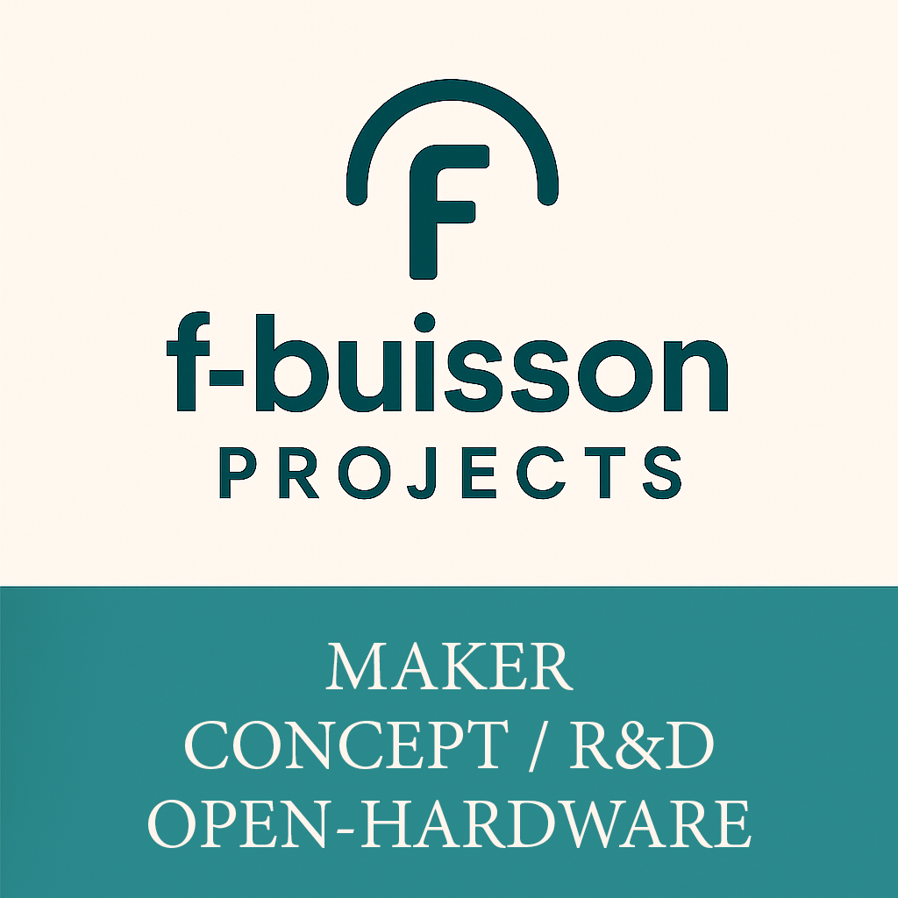

# F-Buisson

### Independent software publisher for retail operations, open POS interoperability and applied R&D

**Retail operations · Workforce planning · Price control · POS interoperability · Applied R&D**

[Website](https://f-buisson.com) · [OpenRetailSchema](https://github.com/f-buisson/OpenRetailSchema) · [Public R&D](#open-source--public-rd) · [Contact](mailto:contact@f-buisson.com) · [Français](#français)

---

## Featured open-source work

### [OpenRetailSchema](https://github.com/f-buisson/OpenRetailSchema)

**Open, vendor-neutral retail data models and an extensible foundation for POS integrations.**

OpenRetailSchema is designed to let applications integrate with multiple POS systems without rebuilding the same data model for every vendor.

**Current focus**

- canonical schemas for retail data;
- explicit connector contracts and capability declarations;
- provenance-preserving normalization;
- generic CSV imports and reproducible fixtures;
- privacy-safe, synthetic test data;
- reusable foundations for analytics, planning and retail automation.

**Integration evidence:** an authorized Loyverse personal-token catalog integration has been tested in a separate F-Buisson product. The OpenRetailSchema connector itself is still experimental and is not presented as live-certified yet.

[Roadmap](https://github.com/f-buisson/OpenRetailSchema/blob/main/docs/ROADMAP.md) ·
[POS integration registry](https://github.com/f-buisson/OpenRetailSchema/blob/main/docs/POS_INTEGRATIONS.md) ·
[Contributing](https://github.com/f-buisson/OpenRetailSchema/blob/main/CONTRIBUTING.md)

> **Contributors wanted:** public API documentation, verified POS capabilities, schema reviews and fabricated sample payloads are welcome. Please never share credentials, tokens or real customer/store data.

---

## Products

<table>
<tr>
<td width="150"><strong>Alertarif</strong> Commercial product</td>
<td><strong>Keep retail prices under control.</strong> Monitoring for prices, promotions, margins and retail data quality, with explicit data limitations and understandable results.</td>
</tr>
<tr>
<td width="150"><strong>PlanCaisse</strong> Commercial product</td>
<td><strong>The right people at the right time.</strong> Checkout-team workforce planning based on operational demand, contracts and real constraints, while keeping schedules understandable and editable by managers.</td>
</tr>
<tr>
<td width="150"><strong>PlanFlux</strong> Commercial product</td>
<td><strong>Track real cross-team staffing support.</strong> Records reinforcement between departments: employee, origin team, destination team, time, duration and reason.</td>
</tr>
</table>

> Commercial applications are developed in private repositories. Public repositories expose open-source work, public R&D, documentation and selected shared foundations only.

---

## How I build

- **Start from real field problems** — solve operational needs before adding features.
- **Keep systems understandable** — important outputs and decisions should be explainable.
- **Keep humans in control** — automate repetitive work without removing managerial judgment.
- **Minimize training** — workflows should be clear enough to use with minimal onboarding.
- **Reuse integration work** — shared foundations should reduce duplicated POS-specific development.

---

## Open source & public R&D

Public work is kept inspectable and evidence-led; private research stays separate until it is mature enough to publish.

### [Solar Flare](https://github.com/f-buisson/Solar-Flare)
Foldable solar concentrator research using a Fresnel lens and parabolic mirrors, with SOLIDWORKS design work, plans and measurements.

### [Plushie — breathe with me](https://github.com/f-buisson/plushie-breathe-with-me)
Interactive plush concept simulating breathing and chest compressions for calm-breathing guidance and CPR awareness.

---

## Français

<strong>Présentation en français</strong>

 

**F-Buisson** développe des logiciels métier pour le commerce, une infrastructure ouverte d’interopérabilité POS et des projets de R&D appliquée.

Le projet open source principal est **[OpenRetailSchema](https://github.com/f-buisson/OpenRetailSchema)** : une couche d'interopérabilité ouverte destinée à normaliser les données issues de différents logiciels de caisse / POS afin qu'une intégration puisse être réutilisée par plusieurs applications.

### Produits

- **Alertarif** — surveillance des prix, promotions, marges et qualité des données.
- **PlanCaisse** — planification des équipes caisse à partir des besoins réels et des contraintes opérationnelles.
- **PlanFlux** — suivi des renforts réellement effectués entre services.

### OpenRetailSchema

Le projet est en développement précoce. Une intégration catalogue Loyverse via jeton personnel autorisé a déjà été testée dans un autre produit F-Buisson, mais le connecteur OpenRetailSchema lui-même reste expérimental et n'est pas encore présenté comme certifié en conditions réelles.

Les contributions sont bienvenues, notamment pour la documentation d'API POS, les capacités vérifiées, les revues de schémas et les exemples synthétiques. Aucun identifiant, jeton ni donnée réelle de magasin ne doit être partagé.

### R&D publique

**[Solar Flare](https://github.com/f-buisson/Solar-Flare)** documente une recherche de concentrateur solaire pliable. **[Plushie — breathe with me](https://github.com/f-buisson/plushie-breathe-with-me)** documente un concept open hardware centré sur la respiration guidée et la sensibilisation à la RCP.

---

### F-Buisson

[**f-buisson.com**](https://f-buisson.com) ·
[**OpenRetailSchema**](https://github.com/f-buisson/OpenRetailSchema) ·
[**contact@f-buisson.com**](mailto:contact@f-buisson.com)

Commercial products and open-source projects are distributed separately under their respective licenses.

